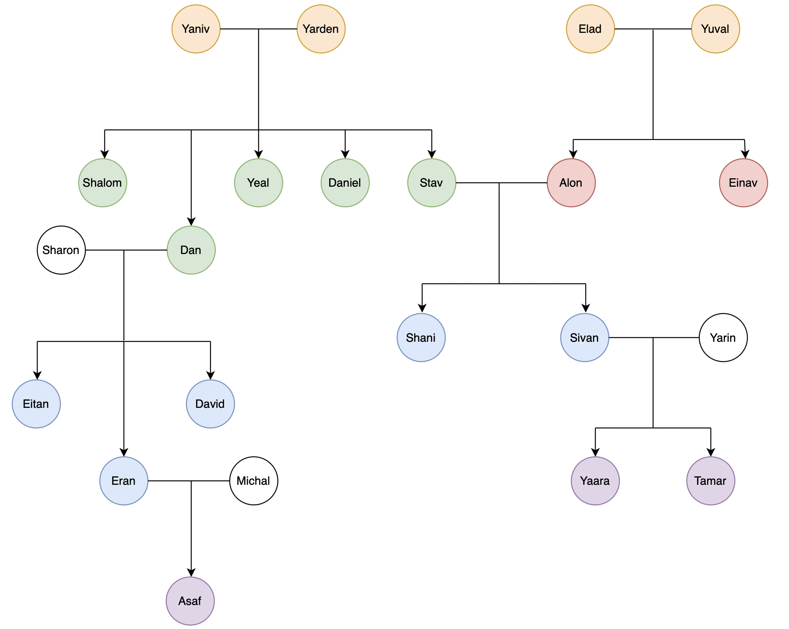

# Family Tree Management Program

## Description
A C program that lets you build and manage a dynamic family tree.  
Supports adding family heads, marrying people, adding children, printing the tree, counting members, and finding relatives by degree.

---

## Features
- Add a family head  
- Marry two people (with age and relationship validation)  
- Add offspring to married couples  
- Print the family tree top-down with generation indentation  
- Increment ages for all members  
- Count total people in the tree  
- Print relatives at a specified degree (e.g., cousins)  

---

## Data Structures
- **Person**: Stores name, age, spouse (`marriedTo`), children, parent, and `visited` flag.  
- **Node**: Linked list node pointing to a `Person` and the next node.  
- **Persons**: Wrapper struct containing the head of the linked list.  

---

## Running demonstration

For demonstration, i have created the following diagram:



To test the code using a family tree like the one in the diagram, place input.txt in the root directory and run:

```
gcc familyTree.c
```
and then run:
```
./a.out < input.txt
```
You can also project the output into a result.txt file by executing:
```
./a.out < input.txt > res.txt
```

In this test, we output the family trees of Yaniv and Yuval, the second-degree relatives of Eran, and the third-degree relatives of Tamar.

```
Yaniv (67) - Yarden (64)
	Shalom (44)
	Dan (44) - Sharon (74)
		Eitan (22)
		Eran (22) - Michal (74)
			Asaf (0)
		David (22)
	Yeal (44)
	Daniel (44)
	Stav (44) - Alon (44)
		Shani (22)
		Sivan (22) - Yarin (74)
			Yaara (0)
			Tamar (0)

Yuval (69) - Elad (64)
	Alon (44) - Stav (44)
		Shani (22)
		Sivan (22) - Yarin (74)
			Yaara (0)
			Tamar (0)
	Einav (44)

Cousins:
David
Eitan
Eran
Shani
Sivan


Cousins:
Asaf
Tamar
Yaara

```

You can also run your own tests by modifying the input.txt file. For example, to print Dan’s subtree, simply append the following to the input file:

```
4
Dan
```

In this way, you can append any command you want.

